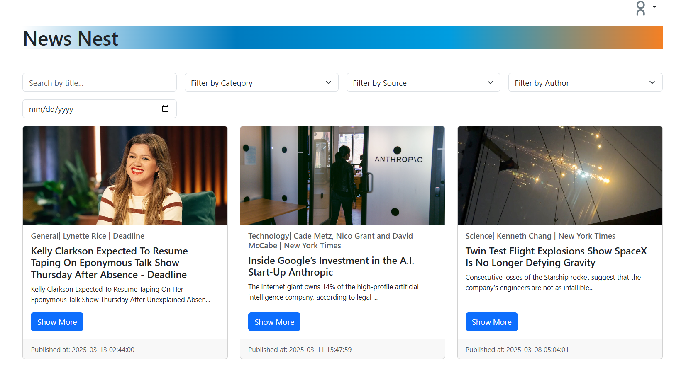

# News Nest - React App



## To run this project

### Method 1

- Clone the project using this command. 

```
git clone https://github.com/EngAbdelrahmanMagdi/News-Nest-React.git
```


- Copy .env.example content inside .env file.
```
cp .env.example .env
```    

- Start Application using Docker by this command.
```
docker compose up -d --build
```

#

### Method 2

- Clone the project using this command. 

```
git clone https://github.com/EngAbdelrahmanMagdi/News-Nest-React.git
```

- Copy .env.example content inside .env file.
```
cp .env.example .env
```  

- Install dependencies using this command.

```
npm install
```
- Start the Server using this command. 

```
npm start
```


## Introduction

- NewsNest is a full-featured news aggregation platform that allows users to:

- Register, log in, and reset passwords.

- Browse and search for articles.

- Filter news by authors, categories, sources, and dates.

- Update their personalized news preferences.


## Features

- User Authentication: Register, login, and reset password.

- News Feed: Browse and read articles from multiple sources.

- Advanced Filtering: Filter articles by authors, categories, sources, and date.

- Personalized Experience: Update news preferences for a customized feed.

- Mobile Responsive: Optimized for all screen sizes.


<h4>Made by / Abdelrahman Magdy</h4>